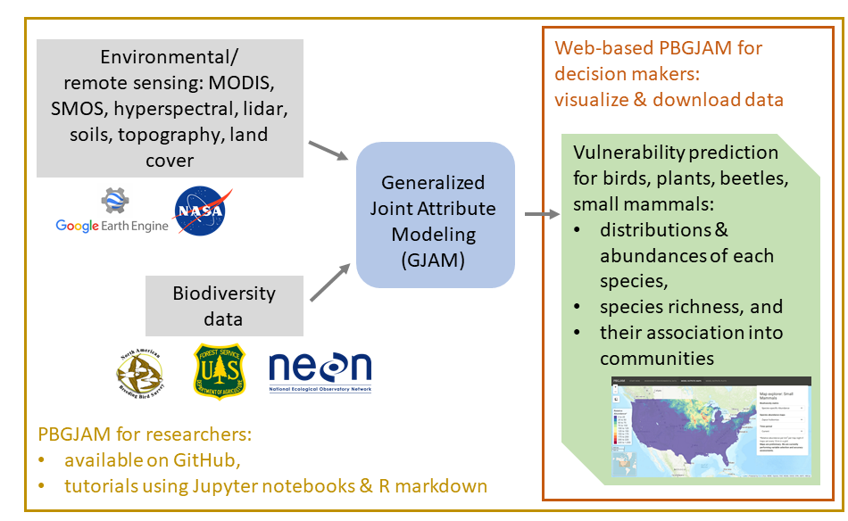
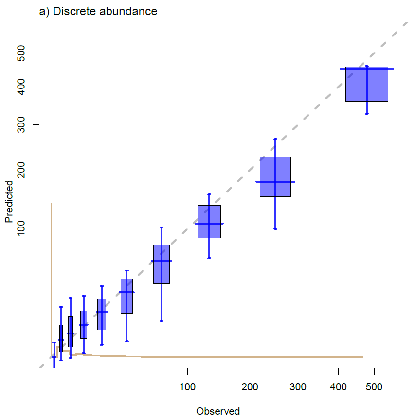
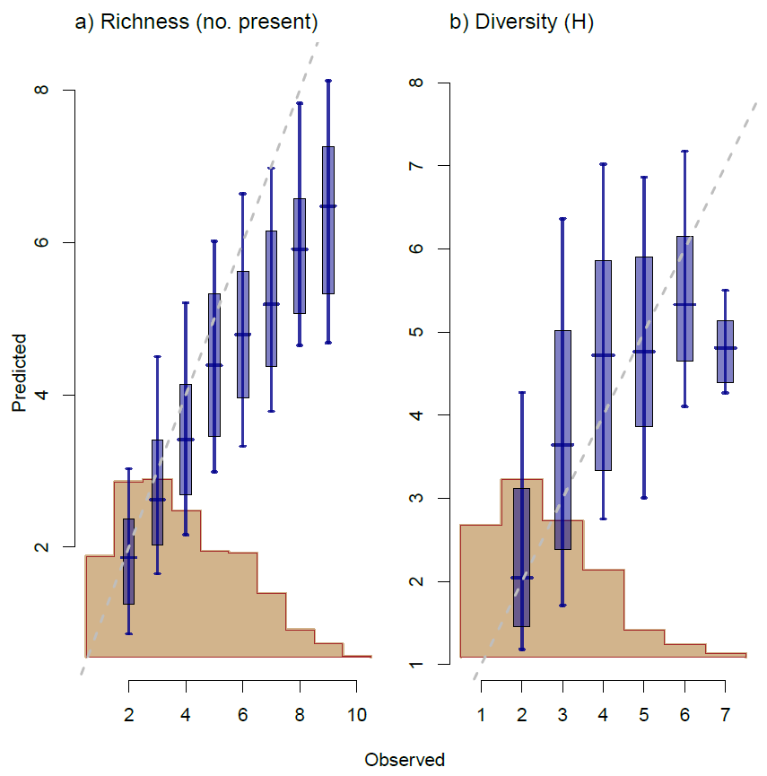
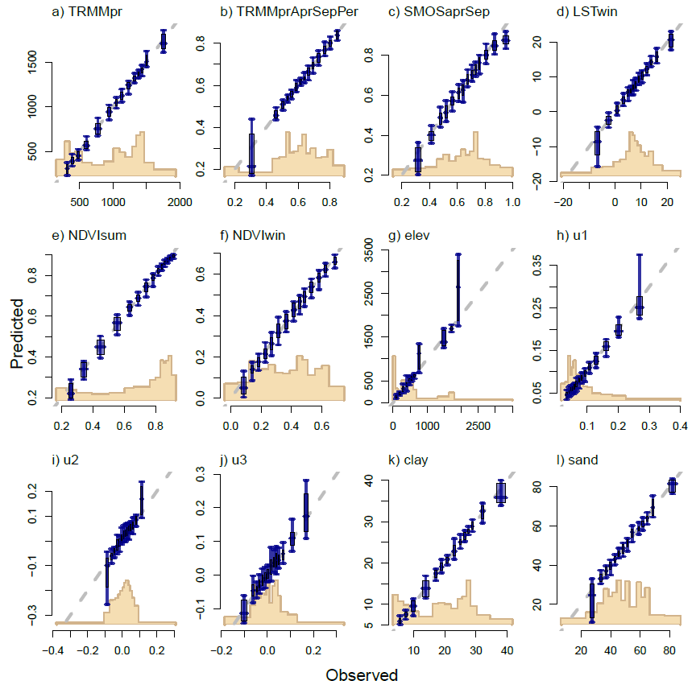
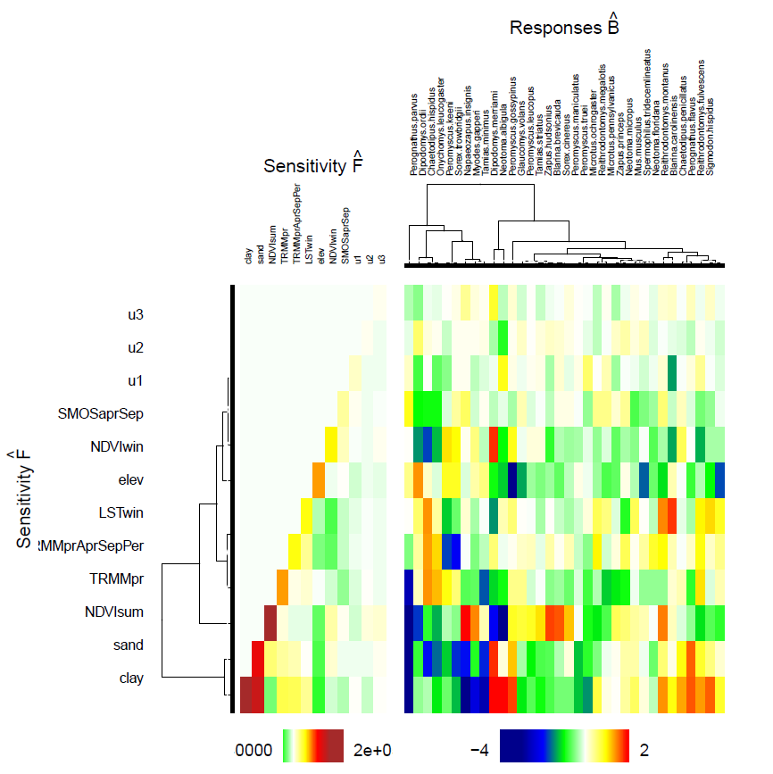

# Used here

* install R studio from CRAN web site
* `neon.Rdata`,`bayesReg.R`
* `install.packages("gjam")`
* more detail:
Clark, J.S., D. Nemergut, B. Seyednasrollah, P. Turner, and S. Zhang. 2017. Generalized joint attribute modeling for biodiversity analysis: Median-zero, multivariate, multifarious data, Ecological Monographs,  87, 34-56. http://onlinelibrary.wiley.com/doi/10.1002/ecm.1241/full

`gjam` vignette: https://cran.r-project.org/web/packages/gjam/vignettes/gjamVignette.html

# PBGJAM: Predicting Biodiversity with Generalized Joint Attribute Models

Our research objectives:

* Assimilate biodiversity and habitat data to predict species and community response to climate change  
* Develop web-based forecasts of climate vulnerability for scientists, managers, and decision makers  
* Transform high-dimensional biodiversity and remote sensing data into near real-time risk predictions

To acomplish these goals we are assimilating biodiversity data, including field-based abundance observations from the Breeding Bird Survey (BBS), Forest Inventory and Analysis (FIA), and the National Ecological Observatory Network (NEON). We developed functions for downloading remotely sensed imagery and other environmental data using Google Earth Engine's python API. We are also integrating lidar and hyperspectral imagery at NEON sites to characterize vegetation structure and foliar traits, respectively. We then use `gjam` to create species distribution and abundance maps to show how communities are expected to reorganize with climate change. Our maps and `gjam` outputs will be available on a web app [PBGJAM](https://pbgjam.env.duke.edu/web-map). Example code and tutorials will be available on github so researchers can use `gjam` with their own biodiversity data. 



# Agenda

* Introductions
* Motivation
* The theory behind `gjam`
* Data inputs  
* How to fit a `gjam`
* How to interpret`gjam`results
* Interact with our PBGJAM web app
* How to download data from GEE using python

# Motivation

Correlative species distribution models (SDMs) determine the observed distribution of a species as a function of environmental covariates. `gjam` was motivated by the challenges of modeling the distributions and abundances of multiple species associated with multifarious data, multivariate response, and zero-inflation.

## Multifarious data 

Abundance data are multifarious, differing among species, across study sites, and in sampling effort. `gjam` combines multiple data types into a single model while avoiding non-linear link functions. Most SDMs limit species abundances to presence-absence, presence-pseudo-absence, or presence-only data, reporting only whether or not a species has been found at a certain point. Other SDMs rely on link functions to model the response. 

`gjam` accommodates discrete and continuous data on the observed scale to allow for transparent interpretation.


Table 1: Example of data types `gjam` accommodates: 

type                   | code    | observation values
-----                  | -----   | -----
continuous, uncensored | `'CON'` | $(-\infty, \infty)$
continuous abundance   | `'CA'`  | $[0, \infty)$
discrete abundance     | `'DA'`  | $\left\{ 0, 1, 2, ...\right\}$
presence-absence       | `'PA'`  | $\left\{ 0, 1\right\}$
ordinal counts         | `'OC'`  | $\left\{ 0, 1, 2, ..., K\right\}$
fractional composition | `'FC'`  | $[0, 1]$

## Multivariate response

Species live within communities where the presence of one species depends not only on its environmental conditions, but also on the presence or absence of other species. Whereas most SDMs treat species as independent of each other, `gjam` models multiple species jointly. Therefore, the response is not $y\sim$ where $y$ is a vector of abundance data for one species, but rather an $n \times S$ matrix where $n$ is the number of observations and $S$ is the number of species.

## Zero-inflation

Species abundance data, regardless of the data type, typically have a median value of zero. Standard regression analyses do not have the capacity to accurately model such data, which are obviously non-normal and difficult to normalize by transformation. In attempting to handle data with many zeros, other SDMs might realize a poor fit and inaccurate predictions. By censoring the data with a multivariate Tobit model, `gjam` accommodates data with many zeros.

# Accounting for uncertainty

We introduce the basic ideas needed for Bayesian analysis, followed by examples showing how `gjam` is used to integrate biodiversity data.

We begin with the concept of *hierarchical modeling* and why it resides comfortably within the Bayesian paradigm.  Uncertainty in parameters, process, and data can all be integrated in a common framework.  

We then discuss`gjam` for **multivariate responses** that can be combinations of discrete and continuous variables, where interpretation is needed on the observation scale.  To allow transparent interpretation `gjam` avoids non-linear link functions.  

We follow with examples showing an application of `gjam` to count data.

## Background Bayes

Bayesian framework takes uncertainty into account by putting distributions on model parameters. Bayesian analysis only became feasible with the expansion of computational power and invention of important tools such as Gibbs sampling in the 1990s. 

Since that time, machine learning has become important, especially where there is a need to filter through large data sets or to arrive at quick answers. However, bayesian analysis remains popular because scientists often want probabilistic models rather than prediction algorithms.

**Hierarchical models** are used to combine observations with processes and parameters, merging well with the Bayesian paradigm.  Hierarchical models do not have to be Bayesian, but they usually are. We introduce these concepts together.  

The basic building blocks are *likelihood* and *prior distribution*.  Hierarchical models organize these pieces into graphs having several levels.  These are the knowns (data and priors) and the unknowns (latent processes and parameter values). It is natural to think of inference this way:

$$[\mbox{unknowns | knowns}] = [\mbox{process, parameters | data, priors}]$$

If notation is unfamiliar: $[A]$ is the probability or density of event $A$, $[A, B]$ is the joint probability of $A$ *and* $B$, and $[A|B]$ is the conditional probability of $A$ given $B$.

This structure comes naturally to a Bayesian.  It can be unwieldy for non-Bayesian methods.  A hierarchical model typically breaks this down as

$$[\mbox{parameters | data, priors}] \propto $$

$$[\mbox{data | parameters, process}] [\mbox{process |parameters}\mbox] [\mbox{parameters | priors}] $$

The left hand side is the joint distribution of unknowns to be estimated, called the *posterior distribution*.  This structure is amenable to simulation, using *Markov Chain Monte Carlo (MCMC)*. *Gibbs sampling* is a common MCMC technique because the posterior can be factored into smaller pieces that can be dealt with one at a time as simpler conditional distributions. We begin with examples involving regression.

## Traditional regression

First we illustrate combinations of discrete and continuous data for a univariate case.

A linear regression model looks like this:

$$y_i \sim N(\mu_i, \sigma^2)$$
$$\mu_i = \beta_0 + \beta_1 x_{1,i} + \dots + \beta_{p+1} x_{p+1,i}$$
The normal distribution on the right-hand side is called a *likelihood*.  This model is called a *linear model* because it is a linear function of the parameters $\beta$.  

## Discrete and continuous data : what about the zeros?

The problem with this analysis is that regression does not allow zeros.  Most of the observed values are zero. For example if we load the small mammal count data from NEON:

```{r loadNeon}
library(gjam)
load('neon.Rdata')
```

We can then plot a histogram of count data for Ord's kangaroo rat, and you can see that there are many zeros. 

```{r hist, fig.height=3.2,fig.cap='Figure 3: Small Mammal abundances are mostly zero'}
mammal <- ydata[,c("Dipodomys.ordii")]
hist(mammal,nclass=50, main = "Histogram of the Ord's Kangaroo Rat")
```

This is not just a minor problem.  If there were a few zeros, with most values bounded away from zero we might argue that it's close enough.  That's not the case here.  


## Tobit regression

The integration of discrete and continuous data on the observed scales makes use of *censoring*.  Censoring extends a model for continuous variables across censored intervals.  Continuous observations are left censored (at zero).  Discrete observations are censored versions of discrete data.  

*Censoring* is used with the effort for an observation to combine continuous and discrete variables with appropriate weight.  In count data effort is determined by the size of the sample plot, search time, or both.  It is comparable to the offset in generalized linear models (GLMs). In count composition data (*e.g.* microbiome data), effort is the total count taken over all species.  In paleoecological data, it is the count for the sample.  In `gjam` discrete observations can be viewed as censored versions of an underlying continuous space.

Censoring provides an attractive alternative.  It allows us to combine continuous and censored data without changing the scale.  In a Tobit model, the censored value is zero, but it also works with other values.  We introduce a latent variable, $W$, that is equal to the response, $Y$, whenever $Y > 0$.  When $Y = 0$, then the latent variable is negative.  

$$y_{i} = \left \{
\begin{matrix}
\ w_{i}, & w_i > 0\\
\ 0,  & w_i \leq 0
\end{matrix}
\right.$$

With this model the regression moves to the latent $W$,   

$$w_i \sim N(\mu_i, \sigma^2) $$

where i represents a single observation. 

As a heuristic, the figure below represents a normal regression versus a Tobit regression, 

```{r, echo = F, warning = F, message = F}
set.seed(202)
a <- 0
b <- 1

nx <- 100
x1 <- seq(-5,5,length.out = nx)
e <- rnorm(nx,0,1.2)

ytrue <- a + b*x1 + e
yout <- ytrue
yout[yout < 0] <- 0

ypredT <- lm(ytrue~x1)
ypredC <- lm(yout~x1)
dataPlot <- as.data.frame(cbind(yout,x1))
source('bayesReg.R')
fitTobit <- bayesReg(yout~x1, dataPlot, ng=10000, TOBIT=T)

par(mfrow = c(1, 2),bty = 'n', mar = c(4, 4, 1, 0.1), cex=0.8, family='serif', pty = "s")
plot(x1,yout,pch = 19, ylim = c(-5, 5),
     ylab = expression(italic(y)), 
     xlab = expression(italic(x)), 
     xlim = c(-5, 5), col = "dimgray")
points(x1,yout,pch = 19,col = "deepskyblue3")
abline(ypredC, lwd = 3, col = "black")
title('Fig. 4a) Uncensored (linear) regression', adj = 0, font.main = 1, font.lab = 1, cex=0.5)
legend("bottomleft",c("observed","latent"), col = c("deepskyblue3","dimgray"), pch = c(16,16))
plot(x1,ytrue,pch = 19, ylim = c(-5, 5),
     ylab = expression(italic(w)), 
     xlab = expression(italic(x)), 
     xlim = c(-5, 5), col = "dimgray")
points(x1,yout,pch = 19,col = "deepskyblue3")
abline(fitTobit$beta[1,1],fitTobit$beta[2,1],lwd = 3, col = "black")
title('Fig. 4b) Censored regression (Tobit)', adj = 0, font.main = 1, font.lab = 1, cex=.5)
```

However, this model is univariate, and in ecology we are interested in modeling an entire community, with multiple response variables. 

## Multivariate Tobit

$$\begin{matrix} y_{is} = \left\{\begin{matrix}w_{is} \quad & if \enspace w_{is} > 0\\ 0 \quad & if \enspace w_{is}\leq 0\end{matrix}\right. \\ \ \\w_{i} \sim MVN(\beta 'x_{i},\Sigma) \end{matrix}$$   

Therefore, we can extend the model to a multivariate Tobit, where $y_{i}$ is a vector of responses: $y_{i} = (y_{i1}, y_{i2},...,y_{iS})$, i represents a single observation, s represents a species and $\Sigma$ is an $S \times S$ covariance matrix. However, this model only applies to continuous abundance data (*e.g.*, basal area).  

## Generalized Joint Attribute Model (GJAM)

The multivariate Tobit framework can then be extended to accomodate multiple types of data. `gjam` itegrates discrete and continuous data using censoring, where positive continuous observations are uncensored, and discrete observations are censored. Therefore, $y_{i}$ can include both continuous and discrete response variables. 

A partition, $p_{is}$, segments the real line into intervals that can be censored or uncensored. $I_{is}$ is an indicator function specifying whether $w_{is}$ is in the correct interval or not.

$$\begin{matrix}y_{is} = \left\{\begin{matrix}w_{is} \quad & if \enspace continuous \\ z_{is},w_{is} \in (p_{z_{is}},w_{z_{is} +1}] \quad & if \enspace discrete \end{matrix}\right. \\ \ \\w_{i} \sim MVN({ \beta'} x_{i},{ \Sigma}) \times \prod_{s=1}^{S} I_{is} \end{matrix}$$   

where is a $\beta$ coefficient for each species and environmental covariate, i represents a single observation and s represents a species. 

The covariance $\Sigma$ represents the covariance between species beyond what has already been explained by the environmental covariates. It can include interactions between species, unaccounted for environmental gradients, and other unexplained sources of error.

We will use the term 'joint' model to mean that species abundance observations make up a joint distribution.  A univariate model describes the residual variance for one species with a parameter $\sigma^2$.  A joint model describes the residual covariance between $S$ species with a $S \times S$ covariance matrix $\Sigma$. When species covary, the estimates of coeffients in the model depend on $\Sigma$.  The joint model further provides conditional relationships between species that help us understand their relationships to one another. Joint models have been available for linear continuous data for some time, termed *multivariate regression*. `gjam` allows us to model the combinations of data common in ecological studies.

# Data

We are assimilating multiple biodiversity datasets as well as environmental data, including climate, topography, land cover, lidar, hyperspectral, and satellite-based imagery (*e.g*. MODIS, Landsat, SMOS, TRMM). Check out our [website](https://pbgjam.env.duke.edu/data) for a full list of data inputs. 

# `gjam` model summary

The basic model for combining data from many species together is outlined in a series of vignettes for the R package `gjam`.    

```{r vignettes, eval = F}
browseVignettes('gjam')
```

To summarize, an observation consists of environmental variables and species attributes, $\lbrace \mathbf{x}_{i}, \mathbf{y}_{i}\rbrace$, $i = 1,..., n$.  The vector $\mathbf{x}_{i}$ contains predictors $x_{iq}: q = 1,..., Q$. The vector $\mathbf{y}_{i}$ contains attributes (responses), such as species abundance, presence-absence, and so forth, $y_{is}: s = 1,..., S$.  The effort,$E_{is}$, invested to obtain the observation of response,$s$, at location,$i$, can affect the observation. The vignettes mentioned above provide many examples with real and simulated data.  Here we show an application to NEON data.


## NEON small mammals

The NEON data used for this example come from counts of small mammals from traps within a plot aggregated to annual observations.  Each plot has a different level of effort, including numbers of traps per plot, number of trap nights per sampling bout, and number of sampling bouts per site.

The objects we loaded from the file `neon.RData` are R objects of this type: 


object      | type               | comment               |
------      | -----------        | --------------------- |
`xdata`     | `data.frame`       | explanatory variables |
`ydata`     | `data.frame`       | species abundance     |
`elist`     | `list`             | sample effort         |

We can think about the data as consisting of *predictors* $X$ and *responses* $Y$.  The difference now is that the response is multivariate.  The predictors, along with some additional useful information about plots, are contained in a `data.frame xdata`.  Here are a few rows,

```{r}
xdata[1:3,]
```

```{r}
ydata[1:3,1:10]
```


We have assigned the same `rownames` to both `xdata` and `ydata`, a `character vector` with the stucture `site_plot`.  We have assigned `colnames` to identify species in `ydata` and the predictors in `xdata`.  All the covariates in `xdata` for this sample dataset are continuous predictors; however, factors can also be used.  

The `data.frame ydata` holds species abundance data as plots $\times$ species. The columns in `ydata` are species. They are counts of small mammals and are considered to be `type` ('DA') for discrete abundance.

Data collection for each plot requires different amounts of effort. The object `elist` is a `list` containing the column numbers that hold effort information, the  `vector elist$columns`, and a $n \times S$ `matrix elist$values`, containing the amount of effort per plot.  These values can be plot-days, plot area, and so on. We originally created `elist` like this: `elist <- list(columns = 1:S, values = effort)`.

## Dimension reduction

The sizes of objects discussed in the previous section are 

```{r xdataDims}
dim(xdata)
dim(ydata)
length(elist$columns)
length(elist$values)
```

All of these objects have the same number of rows (plots).  `elist$values` and `ydata` have the same number of columns (the number of species).  `xdata` has a different number of columns, including both predictors and other information about plots.  There are already some clear challenges here.  In some cases we may have nearly as many species to fit as we have samples.  Suppose the number of predictors in the model is $Q$.  The model we fit will have a $Q \times S$ matrix of coefficients $\mathbf{B}$ and a $S \times S$ covariance matrix $\Sigma$ matrix.  The latter has $S(S+1)/2$ unique coefficients to estimate.  Thus, for our $S = 34$ species a model with 5 predictors requires $QS + S(S+1)/2 = 765$ estimates. 

Large covariance matrices are also a problem because they have to be inverted.  An $S \times S$ covariance matrix requires order $S^3$ operations.  The size of the problem has to be reduced in many cases.

The high dimensionality is addressed with *dimension reduction*, a generic term for methods that find a lower dimensional representation, in this case for the covariance matrix.  The idea here is to summarize the $S \times S$ matrix $\Sigma$ with a much smaller $N \times r$ matrix.  A dimension reduction method has been developed for `gjam`.  Here we specify a much reduced version of $\Sigma$ in a list containing these two values:

```{r reduct, eval=F}
rlist <- list(N = 10, r = 8)
```

The parameter values refer to the maximum number of species groups (`rlist$N`) and the number of parameters allowed for each group (`rlist$r`).  The latter must be smaller than the former.  The size of the covariance matrix is now reduced from $S(S+1)/2$ to $< N*r$.  Moreover, nothing needs to be inverted.  There is still a version of $\Sigma$, but it contains redundancy.

For more information about dimension reduction, refer to Taylor-Rodriguez, 2017: 
Taylor-Rodriguez, Daniel, et al. "Joint species distribution modeling: dimension reduction using Dirichlet processes." Bayesian Analysis 12.4 (2017): 939-967. https://projecteuclid.org/download/pdfview_1/euclid.ba/1478073617

## Fitting the model

We place the elements of the model into `modelList`, 

```{r inputs, eval=F}
modelList <- list(ng=2000, burnin=800, typeNames = 'DA',
                  effort = elist, reductList = rlist)    
```

In `modelList` we provide the number of Gibbs steps `ng`, the number of iterations to discard `burnin`, the data types `typeNames`, the effort `effort`, and the dimension reduction values `reductList`.

We fit the model using the function `gjam` standard R syntax for `formula`,

```{r fit, eval=F}

out1    <- gjam(~ TRMMpr + TRMMprAprSepPer + SMOSaprSep + LSTwin + NDVIsum + NDVIwin + elev + u1 + u2 + u3 + clay + sand, xdata, ydata, modelList)
```

We can plot the output here:

```{r plotgjam, eval=F}
plotPars  <- list(GRIDPLOTS=T, CLUSTERPLOTS=T,SAVEPLOTS = F)
fit       <- gjamPlot(out1, plotPars)
```

The options for plots is illustrated with vignettes at http://sites.nicholas.duke.edu/clarklab/code/. 

# Interpreting a big model

The many fitted coefficients required for a model with many species presents visualization challenges.  Here we provide some interpretation for output available from `gjamPlot`. 

### Accuracy Assessments

The capacity to predict data is evaluated both for inputs in $X$ and outputs in $Y$. The observed vs predicted values for $Y$ are shown below.  Unlike species distribution models (SDMs), which predict either distribution or abundance, `gjam` predicts both.  Species richness can be predicted from the same model as abundance, because each species has an explicit probability of zero.





### Inverse prediction

Does the community predict the environment?

The inverse prediction of continuous inputs in $X$ is shown below.  These confident predictions say that the community is diagnostic of the site. These can include discrete factors such as soils and cover type.  Although specific indicator species rarely provide good estimates of environment `gjam` shows that the full community is a fingerprint for the environment.



### Communities based on responses to the environment

Commonalities in responses across species help to define communities on the basis of *response*, rather than distribution or abundance.  The clustering of responses below can help us rethink community relationships across these diverse species groups. The figure below combines the effects of individual species responses with covariance in the environment.


### Sensitivity of the entire community to the environment

In this example the predictors having the greatest impact are soil condition and summer NDVI.  The covariates with the smallest effect are slope-aspect variables (u1, u2, u3). In this figure the warmer colors along the diagonal of F indicate covariates with higher sensitivities. 



### Fitted coefficients

Estimates from the model are summarized in several formats.  Box and whisker plots of $68\%$ and $95\%$ credible intervals default to include only coefficients having $95\%$ intervals that exclude zero.  These plots will be rendered to the screen or written to `.pdf` files if `SAVEPLOTS = T` is included in `plotPars`.


# Other resources

`help` files and `vignettes` provide fast, simple examples for many data types

Publications available at http://sites.nicholas.duke.edu/clarklab/ include the following:

Clark, J.S. 2016. Why species tell us more about traits than traits tell us about species: Predictive models. Ecology, in press.

Clark, J.S., D. Nemergut, B. Seyednasrollah, P. Turner, and S. Zhang. 2017. Generalized joint attribute modeling for biodiversity analysis: Median-zero, multivariate, multifarious data, Ecological Monographs,  87, 34-56. http://onlinelibrary.wiley.com/doi/10.1002/ecm.1241/full

Taylor-Rodriguez, D., K. Kaufeld, E.M. Schliep, J. S. Clark, and A.E. Gelfand "Joint species distribution modeling: dimension reduction using Dirichlet processes." Bayesian Analysis 12.4 (2017): 939-967.https://projecteuclid.org/download/pdfview_1/euclid.ba/1478073617

# PBGJAM web app

Visit this [link](https://pbgjam.env.duke.edu/web-map) to start interacting with our PBGJAM web app. Currently we only have examples for current and future abundance estimates of small mammals (from NEON); however, by the end of the summer we hope to add current and fucture abundance estimates for trees, beetles, and birds. 

# geedataextract (python package)

Currently, we are creating a python package for downloading environmental and remotely sensed data using the Google Earth Engine (GEE) python API. These functions allow for efficient pre-processing and temporal/spatial aggregation of environmental/remotely sensed data using GEE's cloud computing. Thereby, allowing ecologists with fewer computing resources to use remote sensing data in their own research. Environmental data can be extracted at the nearest pixel to a point or spatially averaged over pixels around a buffer from a point or within a polygon. Shapefiles of points or polygons must be uploaded to GEE in your assets folder. Data tables will be automatically downloaded to your Google Drive. Functions exist for downloading environmental data related to land cover, topograpy, soil condition, climate, soil moisture (SMOS), and landsat & MODIS vegetation indices/products. Source code is available on [github](https://github.com/ASchwantes/geedataextract), along with a [tutorial](https://github.com/ASchwantes/tutorials/blob/master/geeDataExtract.ipynb) in jupyter notebooks. This package was developed under the support of the National Aeronautics and Space Administration's Advanced Information Systems Technology Program (award number AIST-16-0052) and the National Science Foundation (award number 1754443). We also included a jupyter notebook file with examples for using these functions in the geeDataExtract folder of your workshop materials. 

